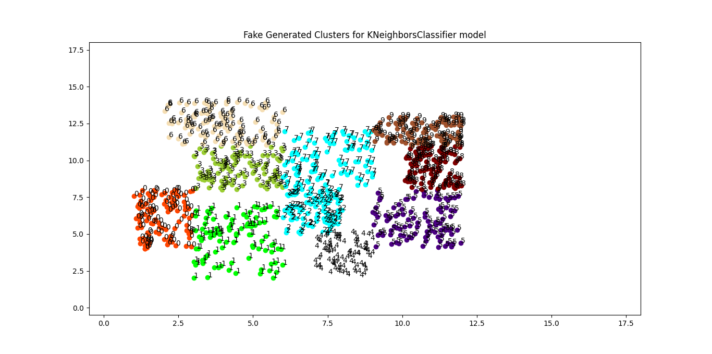
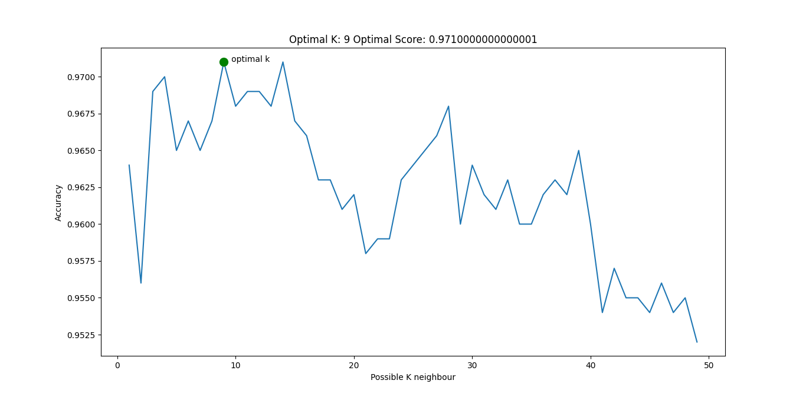
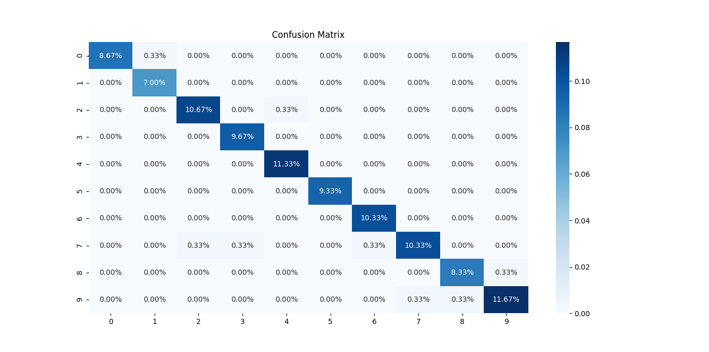
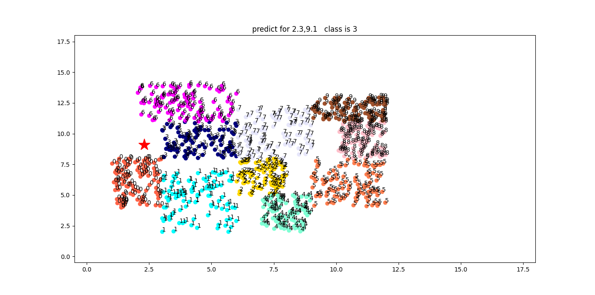
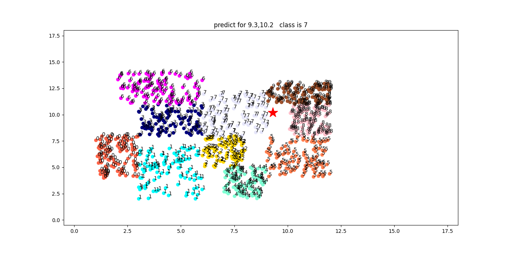

# Directory Structure
```text
.
├── api_test.py
├── app.py
├── data
│   └── clusters.csv
├── docker-compose.yml
├── Dockerfile
├── figures
│   ├── Figure_cm.png
│   ├── Figure_data.png
│   ├── Figure_opt_k.png
│   ├── Figure_pred_2.3_9.1.png
│   ├── Figure_pred_9.3_10.2.png
│   └── Figure_pred_9.7_8.1.png
├── README.md
├── requirements.txt
├── run.py
├── utils
│   ├── data.py
│   ├── model.py
│   └── plot.py
└── weights
    └── knn-kr13v.pkl

4 directories, 18 files

```
# Command Line Interface
```text
usage: run.py [-h] [--load LOAD] [--gen GEN]

optional arguments:
  -h, --help   show this help message and exit
  --load LOAD  True: Load trained model False: Train model default: True
  --gen GEN    True: Generate Fake data False: Use already generated data
```

# Plot Data
### Features: x,y 
### Labels: cluster key



# Train the KNeighborsClassifier model & Generate Data
```shell
python run.py --load no --gen yes
```

# Train the KNeighborsClassifier model & Use Already Genereted Data
```shell
python run.py --load no --gen no
```
## Find Optimal K with Cross-Validation




## Confusion Matrix




## Accuracy Score: 0.971

```text
Do you want to save the model weight? yes
Model saved at weights/knn-kr13v.pkl
```

## Prediction class for (2.3,9.1)



## Prediction class for (9.3,10.2)



## Prediction class for (9.7,8.1)


# Load the trained model

```shell
python run.py --load yes --gen no
```


# Docker for the model

## Build the Docker image

You can build docker image by following:

```shell 
docker-compose build
```

## Run Docker container

You can launch a container from the Docker image by following:

```shell
docker-compose up
```